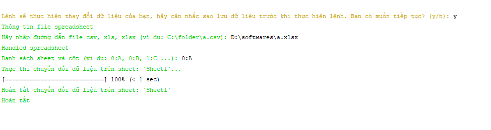

# Migrate phone number

**Tool hổ trợ chuyển đổi số điện thoại 11 số sang 10 số.**

[](https://packagist.org/packages/vxm/migrate-phone-number)
[](https://packagist.org/packages/vxm/migrate-phone-number)
[](https://travis-ci.org/vuongxuongminh/migrate-phone-number)
[](https://scrutinizer-ci.com/g/vuongxuongminh/migrate-phone-number/?branch=master)
[](https://scrutinizer-ci.com/g/vuongxuongminh/migrate-phone-number/?branch=master)
[](http://php.net)

Tool được xây dựng để phục vụ việc chuyển đổi dữ liệu số điện thoại từ 11 số sang 10 số.
Tool hổ trợ chuyển đổi trên các CSDL phổ biến như `mysql, postgres, sql server...` và 
`spreadsheet`.

## Yêu cầu
* [PHP >= 7.1](http://php.net)

## Cài đặt

Cài đặt thông qua `composer` nếu như đó là một khái niệm mới với bạn xin click vào 
[đây](http://getcomposer.org/download/) để tìm hiểu nó.

```sh
composer global require "vxm/migrate-phone-number"
```

## Cách dùng

+ Đối với CSDL (database) thì bạn hãy gõ lệnh CMD sau:

```sh
vxm migrate:db
```

+ Đối với spreadsheet (excel) thì bạn hãy gõ lệnh CMD sau:

```sh
vxm migrate:ss
```

## Screenshot


